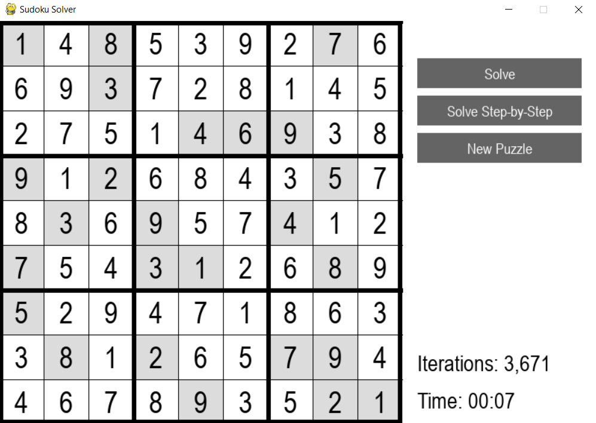

# Sudoku Solver with GUI

This is a Python project that solves Sudoku puzzles and provides a GUI for interactive solving. The solver uses a backtracking algorithm to find a solution.

## Approach

The approach we use for this Sudoku solver is called backtracking, which is a type of depth-first search. Here's how it works:

1. Start with the first empty cell in the grid.
2. Try to fill in the cell with a number from 1 to 9.
3. Check if the number violates any of the Sudoku constraints. If it does, try the next number. If it doesn't, move on to the next empty cell.
4. If you've tried all numbers in a cell and none of them work, backtrack to the previous cell and try the next number there.
5. Continue this process until you've filled in all cells or determined that no solution is possible.

## GUI

The GUI is developed using Pygame. It provides an intuitive interface for users to interact with the Sudoku board, input numbers, and utilize the solver's capabilities. Users can choose to solve the puzzle step-by-step or get the entire solution instantly.



## Details

Sudoku is a constraint satisfaction problem (CSP). This type of problem involves finding values that satisfy a number of constraints. In the case of Sudoku, the constraints (rules of Sudoku) are:

1. Each row must contain all the digits from 1 to 9 (excluding repetitions).
2. Each column must contain all digits from 1 to 9 (excluding repetitions).
3. Each 3x3 subgrid of the 9x9 grid must contain all digits from 1 to 9 (excluding repetitions).
4. Each row, column and subgrid must sum to 45.

The backtracking algorithm is a simple and effective method for solving constraint satisfaction problems. It works well for Sudoku because it systematically tries all possible solutions until it finds one that satisfies all the constraints.

Solved 10,000 puzzles from hard_sudokus.txt with 100% accuracy.

## Requirements

- Python 3.x
- Pygame

To install the requirements:

```
pip install -r requirements.txt
```

## Running the GUI

To run the Sudoku GUI:

```
python gui.py
```


## References

https://youtu.be/Zq4upTEaQyM

Followed the principle of: Choice -> <- Constraints -> <- Goal.

https://see.stanford.edu/materials/icspacs106b/lecture11.pdf

Followed psuedocode from this lecture to implement the backtracking algorithm.
